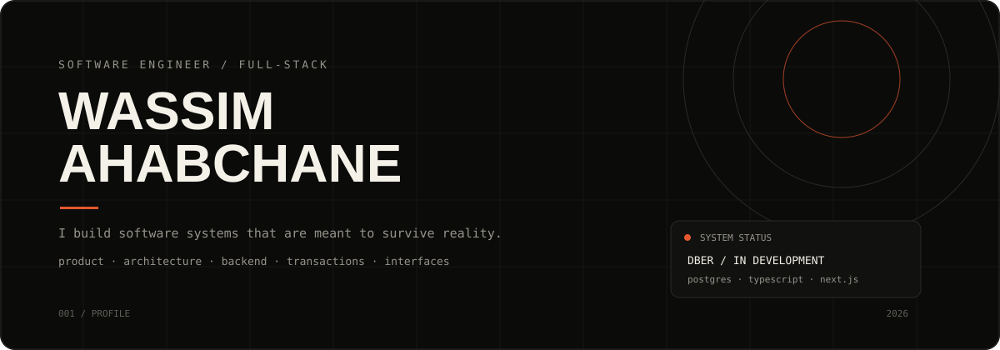
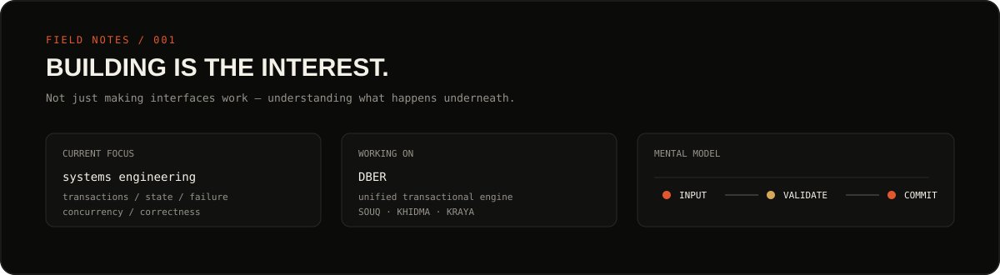

<!-- =========================================================
     WASSIM AHABCHANE — GITHUB PROFILE
     ========================================================= -->

<p align="center">
  
</p>

<p align="center">
  <a href="https://github.com/wassim7254">
    
  </a>
  <a href="mailto:YOUR_EMAIL@example.com">
    
  </a>
</p>

<br />

<p align="center">
  
</p>

---

# 00 · FIELD NOTES

> Software engineer focused on building systems that remain understandable when they stop being simple.

I like the part of software where the prototype ends and the real engineering begins.

The state transitions.

The database.

The failure modes.

The race conditions.

The API contract.

The boring edge case that becomes a production incident.

My current work sits mostly around **TypeScript, Next.js, PostgreSQL, backend architecture and transactional systems**.

I'm especially interested in the intersection between product engineering and systems engineering:

```text
             PRODUCT
                │
                ▼
          ┌───────────┐
          │   DOMAIN  │
          └─────┬─────┘
                │
       ┌────────┼────────┐
       ▼        ▼        ▼
    STATE    DATA     FAILURE
   MACHINE   MODEL     MODES
       │        │        │
       └────────┼────────┘
                ▼
          TRANSACTION
                │
                ▼
           POSTGRESQL
                │
                ▼
        SOMETHING RELIABLE
