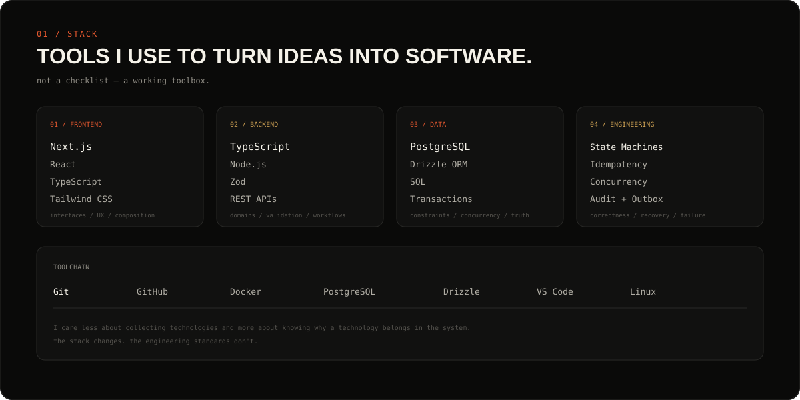
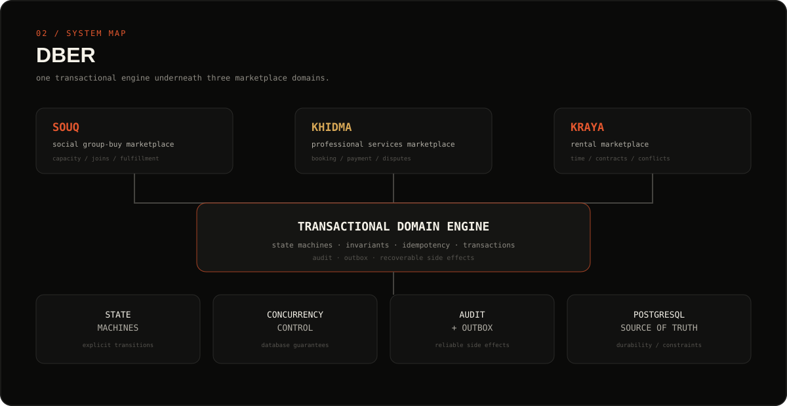
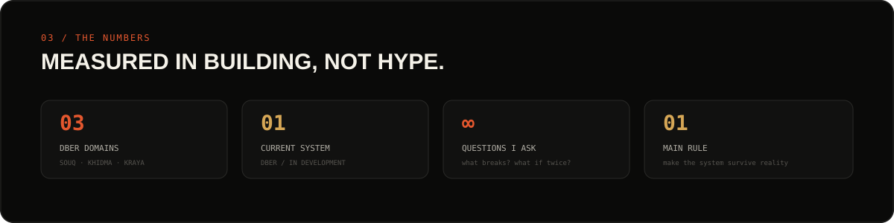
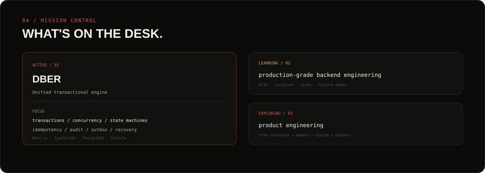
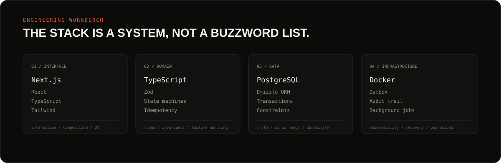
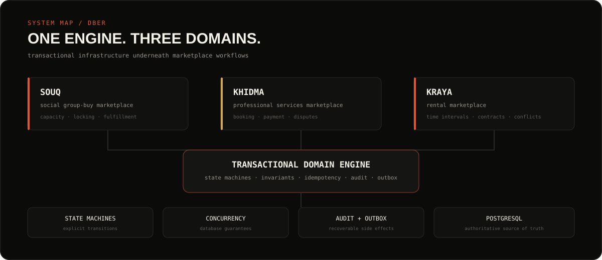
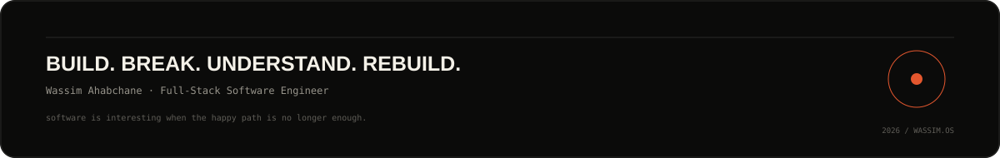

  

  
  

  

---

# 00 · FIELD NOTES

**Software engineer focused on building systems that remain understandable when they stop being simple.**

I like the part of software where the prototype ends and the real engineering begins.

The state transitions.

The database.

The failure modes.

The race conditions.

The API contract.

The boring edge case that becomes a production incident.

My current work sits mostly around **TypeScript, Next.js, PostgreSQL, backend architecture and transactional systems.**

I'm especially interested in the intersection between product engineering and systems engineering.

<pre>
             PRODUCT
                │
                ▼
          ┌───────────┐
          │   DOMAIN  │
          └─────┬─────┘
                │
       ┌────────┼────────┐
       ▼        ▼        ▼
    STATE      DATA    FAILURE
   MACHINE     MODEL    MODES
       │        │        │
       └────────┼────────┘
                ▼
          TRANSACTION
                │
                ▼
           POSTGRESQL
                │
                ▼
        SOMETHING RELIABLE
</pre>

### Current notes

- **01** — Building DBER, a transactional engine across multiple marketplace domains.
- **02** — Going deeper into PostgreSQL, transactions, concurrency and backend architecture.
- **03** — Learning to design systems around invariants instead of happy paths.
- **04** — Exploring how far a modular monolith can go before complexity actually justifies distributed architecture.

---

# 01 · THE STACK

  

### Frontend

`Next.js` · `React` · `TypeScript` · `Tailwind CSS`

### Backend

`Node.js` · `TypeScript` · `REST APIs` · `Zod`

### Data

`PostgreSQL` · `SQL` · `Drizzle ORM` · `Transactions`

### Engineering

`State Machines` · `Idempotency` · `Concurrency` · `Audit Logs` · `Outbox Pattern`

### Tooling

`Git` · `GitHub` · `Docker` · `Linux` · `VS Code`

---

# 02 · SYSTEM MAP

  

## DBER

A unified transactional engine designed around three marketplace domains:

<pre>
                         DBER
                          │
          ┌───────────────┼───────────────┐
          │               │               │
         SOUQ           KHIDMA          KRAYA
          │               │               │
      GROUP BUY       SERVICES          RENTAL
          │               │               │
          └───────────────┼───────────────┘
                          │
                    DOMAIN ENGINE
                          │
        ┌─────────────────┼─────────────────┐
        │                 │                 │
      STATE          TRANSACTIONS       INVARIANTS
      MACHINE            │                 │
        │                │                 │
        └────────────────┼─────────────────┘
                         │
                   POSTGRESQL
                         │
              ┌──────────┼──────────┐
              │          │          │
            AUDIT      OUTBOX    IDEMPOTENCY
              │          │          │
              └──────────┼──────────┘
                         │
                  EXTERNAL EFFECTS
</pre>

### The idea

Most marketplace logic looks simple until multiple users, payments, failures and concurrent requests enter the picture.

A user joins a group.

Another user joins at exactly the same time.

A payment provider sends the same webhook twice.

The server crashes after the database commits.

A cancellation arrives while another operation is executing.

A request is retried because the network timed out.

The interesting engineering problem isn't:

> "Can the feature work?"

It's:

> **"Can the system remain correct when everything goes slightly wrong?"**

---

# 03 · THE NUMBERS

  

| AREA | PRINCIPLE |
| :--- | :--- |
| State | Explicit state machines |
| Money | Integer minor units |
| Time | UTC + half-open intervals |
| Mutations | Idempotency required |
| Data | PostgreSQL as source of truth |
| Audit | Append-only records |
| Side effects | Transactional outbox |
| Concurrency | DB-enforced invariants |
| Errors | Typed domain failures |
| Architecture | Modular monolith |

---

# 04 · MISSION CONTROL

  

## The five questions

### 01 — What can go wrong?

Don't design only the happy path.

Think about:

`invalid input` → `invalid state` → `authorization failure` → `concurrency` → `duplicate request` → `partial failure` → `external failure` → `recovery`

---

### 02 — Who guarantees correctness?

Some rules belong in application code.

Some belong in PostgreSQL.

The strongest systems use both.

<pre>
Application
    │
    ├── business rules
    ├── state transitions
    └── authorization
             │
             ▼
        PostgreSQL
             │
             ├── UNIQUE
             ├── CHECK
             ├── FK
             ├── indexes
             ├── exclusion constraints
             └── transactions
</pre>

---

### 03 — What happens if the request arrives twice?

Every mutation should have a deterministic answer.

<pre>
REQUEST
   │
   ▼
IDEMPOTENCY KEY
   │
   ├──── first request ────► EXECUTE
   │
   └──── duplicate ────────► RETURN SAME RESULT
</pre>

---

### 04 — What happens if the process crashes halfway?

The database transaction should not depend on an external provider being available.

<pre>
DB COMMIT
    │
    ▼
OUTBOX EVENT
    │
    ▼
WORKER
    │
    ▼
EXTERNAL SIDE EFFECT
</pre>

---

### 05 — What happens if two users do it simultaneously?

Don't rely on:

`SELECT` → `check` → `INSERT`

when the database itself can guarantee the invariant.

Prefer:

<pre>
TRANSACTION
    │
    ▼
LOCK / ATOMIC UPDATE / CONSTRAINT
    │
    ▼
VALIDATE
    │
    ▼
COMMIT
</pre>

---

# 05 · WORKBENCH

  

## Architecture

I prefer clear boundaries over premature complexity.

<pre>
┌─────────────────────────────────────────────────────────────┐
│                         APPLICATION                         │
│                                                             │
│   HTTP / API / UI / validation / request context            │
└──────────────────────────────┬──────────────────────────────┘
                               │
                               ▼
┌─────────────────────────────────────────────────────────────┐
│                           DOMAIN                            │
│                                                             │
│   entities / invariants / state machines / policies         │
└──────────────────────────────┬──────────────────────────────┘
                               │
                               ▼
┌─────────────────────────────────────────────────────────────┐
│                        INFRASTRUCTURE                        │
│                                                             │
│   database / idempotency / audit / outbox / providers       │
└──────────────────────────────┬──────────────────────────────┘
                               │
                               ▼
┌─────────────────────────────────────────────────────────────┐
│                         POSTGRESQL                           │
│                                                             │
│                 authoritative source of truth               │
└─────────────────────────────────────────────────────────────┘
</pre>

### Repository

Repositories answer:

> How do we persist and retrieve this thing?

### Domain

Domain logic answers:

> What is allowed to happen?

### Application service

Application logic answers:

> In what order should these operations happen?

### Infrastructure

Infrastructure answers:

> How do we communicate with databases and external systems?

---

# 06 · ENGINEERING PHILOSOPHY

  

## 01 — Model the domain

Don't start with controllers.

Start with:

`entities` · `states` · `actions` · `invariants` · `transitions` · `failure modes`

---

## 02 — Make illegal states difficult to represent

If something is impossible by definition, enforce it.

**Application validation**

+

**Domain validation**

+

**Database constraints**

Defense in depth.

---

## 03 — State should be explicit

Instead of scattered booleans:

`isPaid` · `isCancelled` · `isConfirmed` · `isCompleted`

prefer an explicit state machine.

<pre>
created
   │
   ▼
authorized
   │
   ▼
captured
   │
   ├──────────────► refund_pending
   │                       │
   │                       ▼
   │                    refunded
   │
   ▼
completed
</pre>

---

## 04 — Expect failure

Networks fail.

Providers timeout.

Workers crash.

Requests duplicate.

Transactions deadlock.

Users refresh.

Webhooks arrive late.

Webhooks arrive twice.

The architecture should assume this.

---

## 05 — Database constraints are part of the design

PostgreSQL is not just storage.

It is part of the correctness boundary.

`UNIQUE` · `CHECK` · `FOREIGN KEY` · `EXCLUSION CONSTRAINT` · `ROW LOCK` · `TRANSACTION` · `ISOLATION`

---

# 07 · DBER — THE CURRENT BUILD

  

## SOUQ

A group-buy marketplace.

**Core problems**

`capacity` · `concurrent joins` · `supplier confirmation` · `fulfillment` · `expiration` · `cancellation`

---

## KHIDMA

A professional-services marketplace.

**Core problems**

`quotes` · `booking` · `commercial snapshots` · `payment confirmation` · `professional availability` · `overlapping bookings` · `disputes` · `refunds`

---

## KRAYA

A rental marketplace.

**Core problems**

`rental intervals` · `availability` · `pricing` · `contract snapshots` · `overlapping reservations` · `payment` · `cancellation` · `disputes`

---

All three domains share infrastructure where it makes sense without collapsing into one giant generic marketplace abstraction.

---

# 08 · TRANSACTIONAL THINKING

<pre>
                 REQUEST
                    │
                    ▼
             CORRELATION ID
                    │
                    ▼
                  AUTH
                    │
                    ▼
              AUTHORIZATION
                    │
                    ▼
              IDEMPOTENCY
                    │
                    ▼
               VALIDATION
                    │
                    ▼
             DOMAIN LOGIC
                    │
                    ▼
              TRANSACTION
                    │
          ┌─────────┼─────────┐
          │         │         │
          ▼         ▼         ▼
        STATE      AUDIT    OUTBOX
       CHANGE      ENTRY     EVENT
          │         │         │
          └─────────┼─────────┘
                    │
                    ▼
                  COMMIT
                    │
                    ▼
                RESPONSE
</pre>

**External side effects happen after the transaction.**

Not before.

Not halfway through.

Not because a controller happened to call an SDK.

---

# 09 · THINGS I'M DEEPENING

### PostgreSQL

`transactions` · `isolation` · `locking` · `indexes` · `constraints`

### Backend architecture

`domain boundaries` · `application services` · `repositories` · `error handling` · `background workers`

### Distributed systems

`idempotency` · `retries` · `eventual consistency` · `at-least-once delivery` · `reconciliation`

The goal isn't to collect technologies.

The goal is to understand **why systems behave the way they do.**

---

# 10 · FAVORITE KIND OF PROBLEM

<pre>
"It works."

          ↓

"But what happens if..."

          ↓

"Two users do it simultaneously."

          ↓

"The request is sent twice."

          ↓

"The provider times out."

          ↓

"The worker crashes."

          ↓

"The webhook arrives tomorrow."

          ↓

"The database commits but the process dies."

          ↓

"Now make it correct."
</pre>

That's where engineering gets interesting.

---

# 11 · THE SHORT VERSION

I'm a software engineer who likes building things from the interface all the way down to the database.

Currently focused on:

**TypeScript · Next.js · PostgreSQL · backend architecture · transactional systems**

I care about:

**correctness · simplicity · explicit state · failure handling · maintainability**

And I'm currently spending a lot of time learning how to turn:

<pre>
working software
      ↓
well-designed software
      ↓
reliable software
      ↓
software other people can depend on
</pre>

---

# 12 · CURRENTLY BUILDING

## DBER

**A transactional engine for marketplace workflows.**

| DOMAIN | PURPOSE |
| :--- | :--- |
| SOUQ | Group buying |
| KHIDMA | Professional services |
| KRAYA | Rentals |

### Built around

`PostgreSQL` · `Drizzle` · `TypeScript` · `Next.js` · `Zod` · `Docker`

### Engineering around

`State Machines` · `Transactions` · `Idempotency` · `Auditability` · `Outbox Processing`

---

# 13 · A NOTE ON SHIPPING

I don't consider a project "finished" just because the UI works.

For me, shipping means getting closer to answering:

- Can it handle bad input?
- Can it handle duplicate requests?
- Can it handle concurrent users?
- Can it survive a crash?
- Can it recover?
- Can we audit what happened?
- Can we explain why the system is in this state?
- Can another engineer understand it six months later?

That's the standard I'm trying to build toward.

---

  

  
  
  

  

